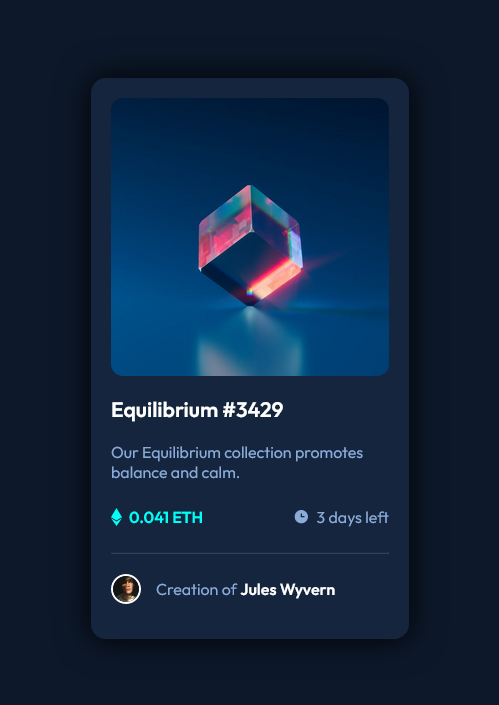

# Frontend Mentor - NFT preview card component solution

This is a solution to the [NFT preview card component challenge on Frontend Mentor](https://www.frontendmentor.io/challenges/nft-preview-card-component-SbdUL_w0U). Frontend Mentor challenges help you improve your coding skills by building realistic projects. 

## Table of contents

- [Overview](#overview)
  - [The challenge](#the-challenge)
  - [Screenshot](#screenshot)
  - [Links](#links)
- [My process](#my-process)
  - [Built with](#built-with)
  - [What I learned](#what-i-learned)
  - [Continued development](#continued-development)
  - [Useful resources](#useful-resources)
- [Author](#author)
- [Acknowledgments](#acknowledgments)


## Overview

In this project, I will build a NFT Preview Card.

### The challenge

Users should be able to:

- View the optimal layout depending on their device's screen size
- See hover states for interactive elements

### Screenshot




### Links

- Solution URL: [GitHub Site](https://dakuwon.github.io/NFT-Preview-Card-Component/)


## My process

First, we created around 10 div element tags, all with classes. Each class pertained to
a CSS selector for the card, such as box-text, image, author etc. These classes were aligned
in order from top to bottom, the same way the card is laid out. After that, I applied style to 
each class and element. In CSS, we used a combination of Pseudo-class selectors with simple selectors and also combinator selectors. Next, we styled each HTML tag from top to bottom as close as possible to the preview card. 

### Built with

- Semantic HTML5 markup
- CSS custom properties
- Flexbox


### What I learned

These were some CSS properties that I have not used before. The overflow property specifies what should happen if content overflows an element's box.
Transform was the second one... it lets you rotate, scale, skew, or translate an element. It modifies the coordinate space of the CSS visual formatting model. I also learned a little more about position and display. 

```css
.img-top {
    border-radius: 12px;
    overflow: hidden;
    position: relative;
}
 .img-overlay img {
    position: absolute;
    width: 50px;
    left: 50%;
    top: 50%;
    transform: translate(-50%, -50%);
}

```


### Continued development

I need to have better understanding of display: and position: properties... such as absolute and relative. Stronger understanding of block and inline-block with image files. Box-sizing border box as well. I need to learn why and when to use each. Deeper understanding of the anatomy of all the properties above.


### Useful resources

- [Transform CSS MDN](https://developer.mozilla.org/en-US/docs/Web/CSS/transform) - This is where I learned about transform.
- [Overflow CSS W3schools](https://www.w3schools.com/css/css_overflow.asp) - W3schools taught me about Overflow.


## Author

- Website - [Matthew McCane](https://matthewmccane.blogspot.com)
- Frontend Mentor - [@DakuwoN](https://www.frontendmentor.io/profile/DakuwoN)
- Twitter - [@McCane_Matthew](https://www.twitter.com/mccane_matthew)


